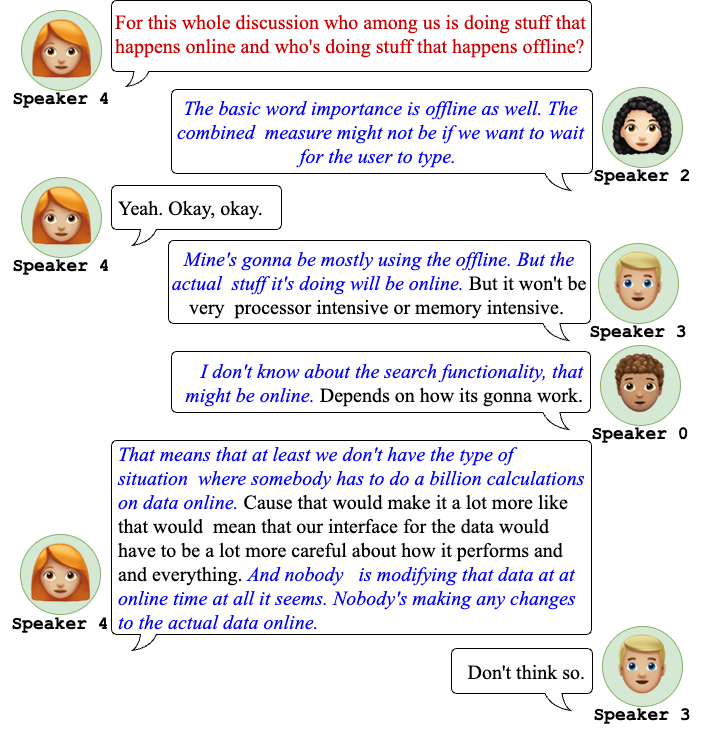

# MeetingQA: Extractive Question-Answering on Meeting Transcripts (ACL 2023)
* Authors: [Archiki Prasad](https://archiki.github.io), [Trung Bui](https://research.adobe.com/person/trung-bui/), [Seunghyun Yoon](https://david-yoon.github.io/), [Hanieh Deilamsalehy](https://research.adobe.com/person/hanieh-deilamsalehy/), [Franck Dernoncourt](https://research.adobe.com/person/franck-dernoncourt/), [Mohit Bansal](https://www.cs.unc.edu/~mbansal/)
* [Paper](https://aclanthology.org/2023.acl-long.837/) // [Project Page](https://archiki.github.io/meetingqa.html)
* **Note:** This repository contains code and data (to be added shortly) for our ACL 2023 paper "MeetingQA: Extractive Question-Answering on Meeting Transcripts".



## Dependencies
This code is written using PyTorch and [HuggingFace's Transformer repo](https://github.com/huggingface/pytorch-transformers). Running MeetingQA baselines requires access to GPUs. Most evaluations are relatively light-weight, so a total of 2-3 GPUs should suffice.

## Installation and Setup
### Repo Structure
The consituent folders are described below (also refer to corresponding `README.md` files in the folders):
* **requirements:** Contains various `*_requirements.txt` files used to setup multiple conda environments used throughout the project.
* **DataCollection:**  Contains *code* used for gathering and processing raw meeting transcripts/datasets.
* **PostAnnotationProcessing:** Contains *code* use in annotation and post-processing of meeting transcripts for QA.
* **qaCode:** Contains *code* for training models and running experiments.
* **ProcessedTranscripts:** Contains processed meeting transcripts (*data*).
* **SyntheticDataset:** Contains dataset files used for model training and evaluation (*data*).

### Setting up from scratch
In order to setup the project from scratch, follow the steps described in the folders following the order `requirements -> DataCollection -> PostAnnotationProcessing -> qaCode`. The appropriate *data* files and folders will be created in the process starting with `ProcessedTranscripts` followed by `AllData`.

## Reference
Please cite our paper if you use our repository and/or dataset in your works:
```bibtext
@article{prasad2023meeting,
  author    = {Archiki Prasad, Trung Bui, Seunghyun Yoon,  Hanieh Deilamsalehy, Franck Dernoncourt, and Mohit Bansal},
  title     = {MeetingQA: Extractive Question-Answering on Meeting Transcripts},
  journal   = {61st Annual Meeting of the Association for Computational Linguistics (ACL)},
  year      = {2023}
```
